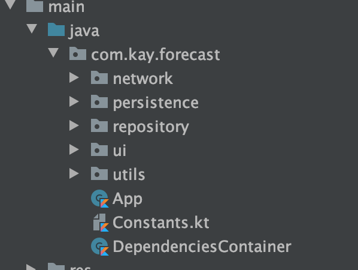

# ForeCast

A small application with SOLID principles, MVVM design pattern, backed by Android Architecture Components + Kotlin Coroutine.

## Code structure

1. **_ui_** with MainActivity and its ViewModel.

-   MainActivity will observe and react to changes in _viewmodel's livedata_
-   MainActivity can also trigger a search by calling _viewmodel#searchCity_
-   ViewModel will query the forecasts from **_repository_** (its single source-of-truth) and update it's livedata upon receiving data.

2. **_repository_** hosts the WeatherRepository, it acts like a mediator for **_network_** and **_cache data_**. It also performs the caching logics.
3. **_persistence_** contains **_cache data_**(backed by **Room** and a simple cache for search query)
4. **_network_** backed by Retrofit api and its related responses
5. **_DependenciesContainer_** will wire all required dependencies and got initialized in _App#onCreate_

## Testing

1. Mockk for mock test
2. Robolectric with Androidx Test support.

## Checklists

1. ~~Programming language: Kotlin is required, Java is optional.~~
2. ~~Design app's architecture (suggest MVVM)~~
3. ~~Apply LiveData mechanism~~
4. ~~UI should be looks like in attachment.~~
5. ~~WriteUnitTests~~
6. AcceptanceTests
7. ~~Exceptionhandling~~
8. ~~Cachinghandling~~
9. SecureAndroidappfrom:

-   ~~Decompile APK~~
-   Rooted device
-   ~~Data transmission via network~~
-   Encryption for sensitive information

10. ~~Accessibility for Disability Supports:~~

-   ~~Talkback:Useascreenreader.~~
-   ~~Scaling Text: Display size and font size: To change the size of items on your screen, adjust the display size or font size.~~

11. Entity relationship diagram for the database and solution diagrams for the components, infrastructure design if any
